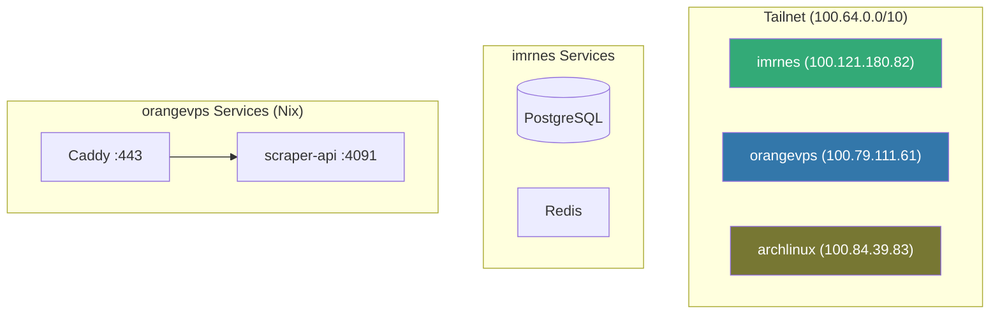
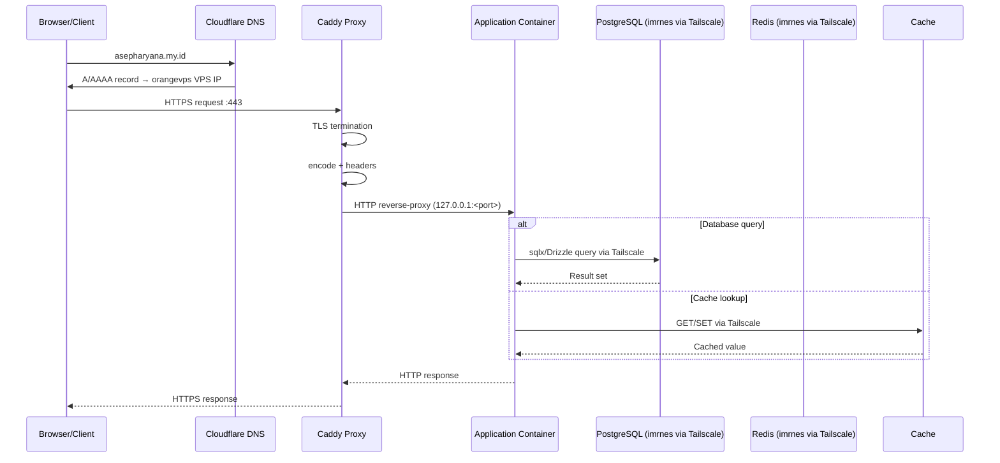
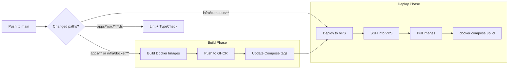
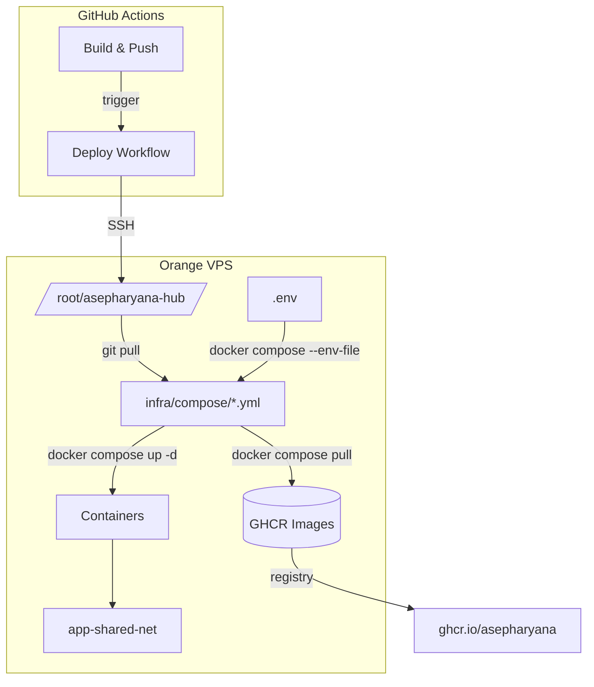
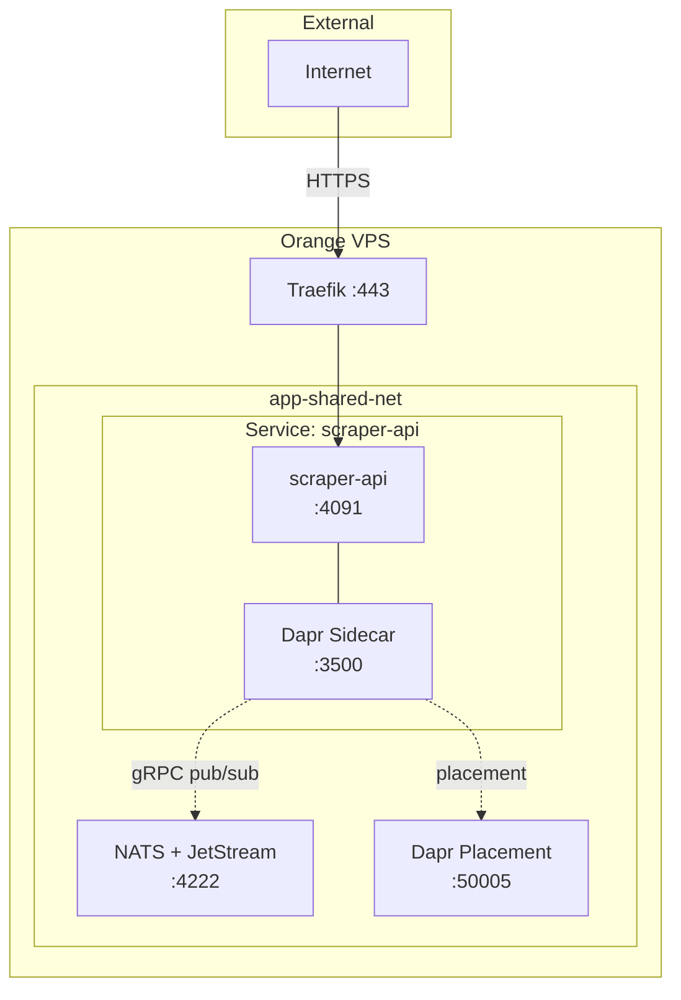

# Architecture

## Hub Repository Structure Overview

```
asepharyana-hub/
├── apps/                    # Application services (Git submodules)
│   └── scraper/            # Web scraper service
├── docs/                    # Documentation
│   ├── adr/                # Architecture Decision Records
│   ├── add-new-app.md      # Guide for adding new services
│   └── superpowers/        # Project capabilities tracking
├── infra/                   # Infrastructure as code (LEGACY Docker layout)
│   ├── compose/            # Docker Compose files (LEGACY — Docker dihapus 2026-08-02)
│   ├── config/             # Infrastructure configuration
│   ├── docker/             # Dockerfiles (LEGACY)
│   ├── traefik/            # Traefik config (LEGACY — diganti Caddy)
│   └── caddy/              # Caddyfile.prod (reverse proxy produksi)
├── scripts/                 # Utility scripts
│   ├── git-hooks/          # Git hook scripts
│   ├── cleanup-ghcr.sh     # GHCR image cleanup
│   └── update-deps.sh      # Dependency update helper
├── .github/workflows/       # CI/CD pipelines
├── eslint.config.mjs        # Root ESLint config
├── package.json             # Root formatting/lint helper scripts
└── .prettierrc              # Prettier formatting rules
```

## Technology Stack

### Services

| Service   | Language/Runtime | Framework | Database | Key Libraries |
| --------- | ---------------- | --------- | -------- | ------------- |
| **scraper** | _(submodule)_  | —         | —        | —             |

### Infrastructure

| Component          | Technology              | Purpose                                                          |
| ------------------ | ----------------------- | ---------------------------------------------------------------- |
| Reverse Proxy      | Caddy 2.11.4            | TLS termination (auto-LE), routing, HTTP/3, keep-alive tuning    |
| Runtime           | Nix + systemd           | Service isolation and orchestration (Docker dihapus 2026-08-02)  |
| Deployment        | GitHub Actions          | nix build → nix copy ssh:// → systemctl restart                  |
| Secrets           | Bitwarden Secrets Manager (BWS) | Central secret store, bws-exec wrapper                     |
| Networking         | Tailscale               | Secure overlay network between VPS nodes                         |
| Message Bus        | NATS + JetStream        | Event-driven pub/sub, job queues, streaming                      |
| Runtime Sidecar    | Dapr                    | Service invocation, pub/sub abstraction, state management        |
| Cache & State      | Redis (Alpine)          | Session store, rate limit counters, caching, Dapr state store    |
| CI/CD              | GitHub Actions          | Build, test, deploy automation                                   |

## Infrastructure

### Caddy Reverse Proxy

Caddy 2.11.4 runs as the entry point for all HTTP/S traffic (systemd `caddy.service`, `/etc/caddy/Caddyfile`). It is configured via:

- **Auto-TLS**: Let's Encrypt per-domain (email asepharyana@gmail.com)
- **HTTP/3**: h3 enabled on :443 (QUIC)
- **Snippet `(proxy)`**: shared handler — `encode zstd gzip`, security headers, keep-alive upstream (keepalive 120s, max_conns_per_host 100, dial_timeout 3s)
- **Upload domain** (`upload.asepharyana.my.id`): `flush_interval -1` (streaming), `request_body max_size 0` (unlimited)

Reference: `infra/caddy/Caddyfile.prod`. Legacy Traefik configs stay under `infra/traefik/` for reference only.

### Port Mapping (Produksi)

| Service | Port | Domain |
|---------|------|--------|
| TeleUploader | 4000 | upload.asepharyana.my.id |
| GMW backend | 4001 | (internal) |
| pr-agent | 4002 | pr-agent.asepharyana.my.id |
| hub frontend | 4003 | asepharyana.my.id |
| lidm frontend | 4004 | lidm.asepharyana.my.id |
| lidm backend | 4005 | lidm-api.asepharyana.my.id |
| zeavis API | 4006 | api-zeavisedu.asepharyana.my.id |
| tools frontend | 4007 | tools.asepharyana.my.id |
| tools gateway | 4008 | (internal) |
| GMW proxy | 4009 | imphnen.asepharyana.my.id |
| llm-api | 4010 | ai.asepharyana.my.id |
| zeavisedu nginx | 4011 | zeavisedu.asepharyana.my.id |
| zeavis ML | 4012 | ml-zeavisedu.asepharyana.my.id |
| dashboard | 4013 | dashboard.asepharyana.my.id |
| 9router | 4014 | 9router.asepharyana.my.id |
| scraper | 4091 | scraper.asepharyana.my.id |

### Nix + systemd Deployment

Docker dihapus dari produksi (2026-08-02). Semua service deploy via Nix flakes + systemd:

```bash
nix build .#default --impure --option sandbox false
nix copy --to ssh://vps /nix/store/<hash>
systemctl restart <service>
```

CI/CD: GitHub Actions (`deploy.yml`) → nix build → nix copy → systemctl restart. Flake dibatasi `x86_64-linux` (nixpkgs 26.11 drop darwin).

### Tailscale Networking



Container-to-Tailscale connectivity requires a systemd service that adds a route to the main routing table:

```
ip route add 100.64.0.0/10 dev tailscale0 table main
```

This is managed by `/etc/systemd/system/tailscale-routes.service` on the `orangevps` VPS.

## Data Flow

### Request Flow (Production)



### CI/CD Pipeline



## Deployment Architecture

### Image Tags

- Every push to `main` triggers Docker builds for changed services
- Images are tagged with both `latest` and `sha-<short-sha>` (e.g., `sha-b0ef947`)
- Compose files are auto-updated to pin the new SHA tag
- This enables deterministic rollbacks by reverting the compose file change

### VPS Deployment

The `orangevps` VPS (Tailscale `100.79.111.61`) hosts all application containers:

1. GitHub Actions SSHes into the VPS
2. Production secrets are written as `.env`
3. The repo is synchronized via `git pull`
4. Changed compose files are detected by `git diff`
5. Docker images are pulled (with retry logic for transient failures)
6. Old containers are removed by `container_name`
7. `docker compose up -d` brings up the new containers
8. Traefik automatically detects the new containers via Docker provider

### Selective Deployment

The deploy workflow supports selective updates — if only one compose file changed, only the corresponding service is pulled and recreated, avoiding disruption to other services.



## Submodule Strategy

Each application lives in its own Git repository and is imported as a submodule into `apps/`. This approach:

- **Enables independent development** — each service can be developed, tested, and versioned separately
- **Pins exact commits** — the super-repository tracks exact submodule SHAs, enabling reproducible deployments
- **Supports `repository_dispatch`** — when a submodule receives a push, it can trigger the super-repository to build and deploy only that service

### Submodule Lifecycle

1. Developer pushes to a submodule (e.g., `apps/scraper`)
2. Submodule's GitHub Action dispatches `repository_dispatch` to the super-repo with the service name and new SHA
3. Super-repo detects the dispatch, waits for the SHA to be fetchable, then builds only that service
4. The compose manifest is updated and committed with the new SHA tag
5. The deploy workflow runs and updates only the changed containers

### Updating Submodules

```bash
# Update a single submodule to latest
cd apps/scraper
git checkout main
git pull
cd ../..
git add apps/scraper
git commit -m "chore(scraper): update submodule to latest"
```

## Service Mesh & Inter-Service Communication

### HTTP (External + Internal via Traefik)
External traffic and internal HTTP calls route through Traefik. Services on `app-shared-net` can also communicate directly by container name.

### Event-Driven (NATS + Dapr)
NATS with JetStream provides a persistent message backbone. Each service has a Dapr sidecar that abstracts pub/sub, service invocation, and state management.



### Communication Patterns

| Pattern | Mechanism | Use Case |
|---------|-----------|----------|
| External HTTP | Traefik → Service | User requests, API calls |
| Internal HTTP | Service → Service (via Traefik or direct) | Synchronous queries |
| Pub/Sub Event | Dapr sidecar → NATS JetStream | Async notifications, image cache events |
| Service Invocation | Dapr sidecar gRPC | Cross-service RPC with retry & observability |
| State Store | Dapr → Redis | Shared state, job progress |

## Observability

- **Traefik access logs**: JSON format, logged at INFO level
- **Traefik access logs**: JSON format, logged at INFO level
- **Dashboard**: Traefik dashboard at `traefik.asepharyana.my.id` (secured)
