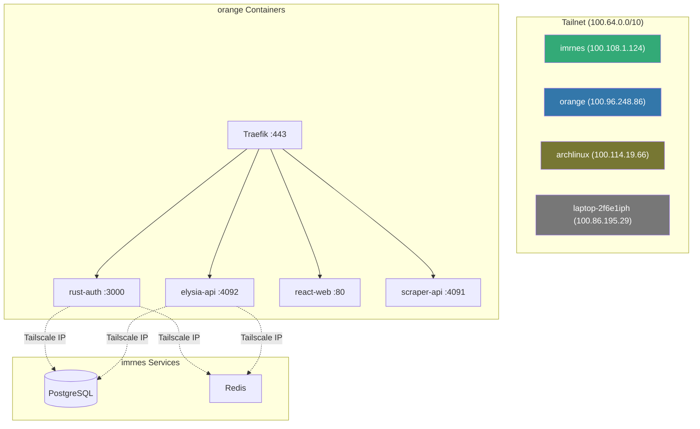
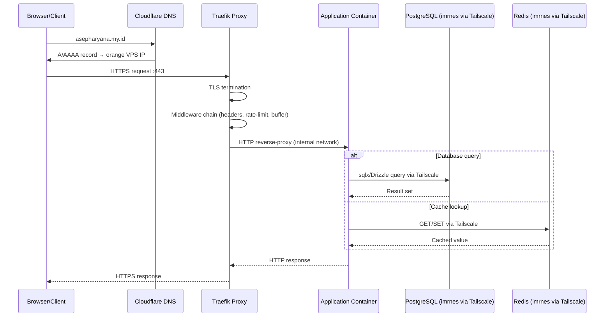
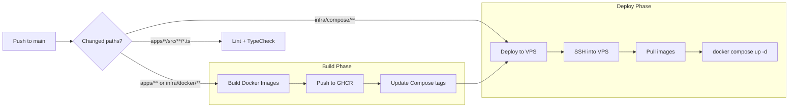
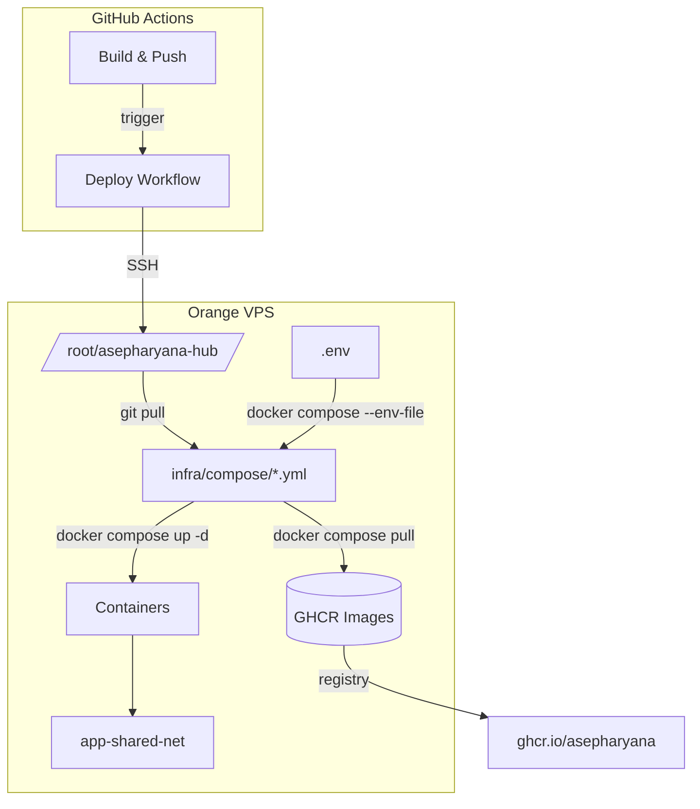
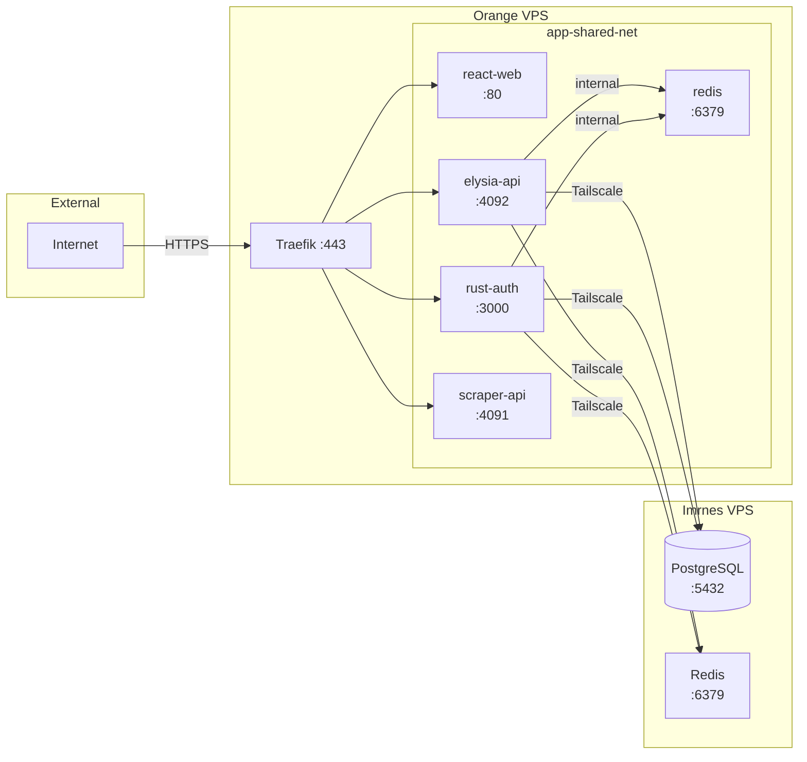

# Architecture

## Hub Repository Structure Overview

```
asepharyana-hub/
├── apps/                    # Application services (Git submodules)
│   └── scraper/            # Web scraper service
├── docs/                    # Documentation
│   ├── adr/                # Architecture Decision Records
│   ├── add-new-app.md      # Guide for adding new services
│   └── superpowers/        # Project capabilities tracking
├── infra/                   # Infrastructure as code
│   ├── compose/            # Docker Compose files per service
│   ├── config/             # Infrastructure configuration
│   ├── docker/             # Dockerfiles per service
│   └── traefik/            # Traefik reverse proxy config
│       └── dynamic/        # Dynamic routing rules (YAML)
├── scripts/                 # Utility scripts
│   ├── git-hooks/          # Git hook scripts
│   ├── cleanup-ghcr.sh     # GHCR image cleanup
│   └── update-deps.sh      # Dependency update helper
├── .github/workflows/       # CI/CD pipelines
├── eslint.config.mjs        # Root ESLint config
├── package.json             # Root formatting/lint helper scripts
└── .prettierrc              # Prettier formatting rules
```

## Technology Stack

### Services

| Service   | Language/Runtime | Framework | Database | Key Libraries |
| --------- | ---------------- | --------- | -------- | ------------- |
| **scraper** | _(submodule)_  | —         | —        | —             |

### Infrastructure

| Component          | Technology              | Purpose                                                          |
| ------------------ | ----------------------- | ---------------------------------------------------------------- |
| Reverse Proxy      | Traefik v3.6            | TLS termination, routing, middleware (rate-limit, headers, auth) |
| Container Runtime  | Docker + Docker Compose | Service isolation and orchestration                              |
| Container Registry | GHCR (ghcr.io)          | Docker image storage                                             |
| Networking         | Tailscale               | Secure overlay network between VPS nodes                         |
| Cache              | Redis (Alpine)          | Session store, rate limit counters, caching                      |
| CI/CD              | GitHub Actions          | Build, test, deploy automation                                   |

## Infrastructure

### Traefik Reverse Proxy

Traefik runs as the entry point for all HTTP/S traffic. It is configured via:

- **Static config**: `infra/traefik/traefik.yaml` — entry points, providers, plugins
- **Dynamic config**: `infra/traefik/dynamic/` — routers, services, middlewares, TLS
- **Docker provider**: Auto-discovers containers with `traefik.enable=true` labels
- **File provider**: Loads `apps.yaml` (routers/services), `middlewares.yaml`, `ssl.yaml`

Key middleware chains (`infra/traefik/dynamic/middlewares.yaml`):

- `secure-headers` — SSL redirect, HSTS, XSS protection, CSP
- `compress` — Gzip compression for responses over 256 bytes
- `rate-limit` — 100 avg / 50 burst requests
- `buffer` — 10MB request/response body limit
- `block-sensitive-paths` — blocks `.env`, `.git`, `/wp-admin` etc.
- `common-chain` — composes secure-headers + compress + retry + rate-limit + buffer

All services route through Traefik on port 443 (TLS), with automatic HTTP-to-HTTPS redirect.

### Docker Compose

Each service has its own Compose file under `infra/compose/`. All services join the `app-shared-net` external Docker network, enabling inter-service communication by container name.

Shared services:

- `infra/compose/shared.yml` — Redis (alias: `redis`)
- `infra/compose/traefik.yml` — Traefik reverse proxy

Service compose files are combined during deployment:

```bash
docker compose -f traefik.yml -f shared.yml -f scraper.yml up -d
```

### Tailscale Networking



Container-to-Tailscale connectivity requires a systemd service that adds a route to the main routing table:

```
ip route add 100.64.0.0/10 dev tailscale0 table main
```

This is managed by `/etc/systemd/system/tailscale-routes.service` on the `orange` VPS.

## Data Flow

### Request Flow (Production)



### CI/CD Pipeline



## Deployment Architecture

### Image Tags

- Every push to `main` triggers Docker builds for changed services
- Images are tagged with both `latest` and `sha-<short-sha>` (e.g., `sha-b0ef947`)
- Compose files are auto-updated to pin the new SHA tag
- This enables deterministic rollbacks by reverting the compose file change

### VPS Deployment

The `orange` VPS (Tailscale `100.96.248.86`) hosts all application containers:

1. GitHub Actions SSHes into the VPS
2. Production secrets are written as `.env`
3. The repo is synchronized via `git pull`
4. Changed compose files are detected by `git diff`
5. Docker images are pulled (with retry logic for transient failures)
6. Old containers are removed by `container_name`
7. `docker compose up -d` brings up the new containers
8. Traefik automatically detects the new containers via Docker provider

### Selective Deployment

The deploy workflow supports selective updates — if only `infra/compose/elysia.yml` changed, only `elysia-api` is pulled and recreated, avoiding disruption to other services.



## Submodule Strategy

Each application lives in its own Git repository and is imported as a submodule into `apps/`. This approach:

- **Enables independent development** — each service can be developed, tested, and versioned separately
- **Pins exact commits** — the super-repository tracks exact submodule SHAs, enabling reproducible deployments
- **Supports `repository_dispatch`** — when a submodule receives a push, it can trigger the super-repository to build and deploy only that service

### Submodule Lifecycle

1. Developer pushes to a submodule (e.g., `apps/elysia`)
2. Submodule's GitHub Action dispatches `repository_dispatch` to the super-repo with the service name and new SHA
3. Super-repo detects the dispatch, waits for the SHA to be fetchable, then builds only that service
4. The compose manifest is updated and committed with the new SHA tag
5. The deploy workflow runs and updates only the changed containers

### Updating Submodules

```bash
# Update a single submodule to latest
cd apps/elysia
git checkout main
git pull
cd ../..
git add apps/elysia
git commit -m "chore(elysia): update submodule to latest"

# Update all submodules
git submodule update --remote --merge
```

## Service Mesh & Inter-Service Communication



## Observability

- **Prometheus metrics**: Available on rust-auth via `axum-prometheus`
- **Traefik access logs**: JSON format, logged at INFO level
- **Dashboard**: Traefik dashboard at `traefik.asepharyana.my.id` (secured)
